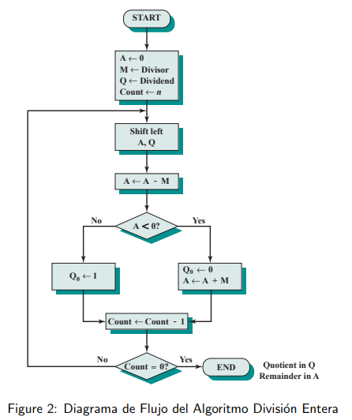
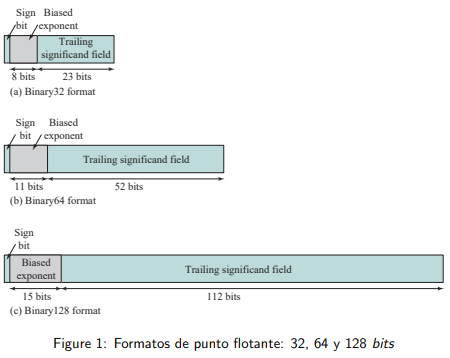
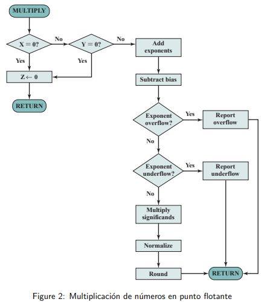

# ArquitecturaDeComp

Índice

* [Division de enteros ](https://github.com/MaycolZx/ArquitecturaDeComp/blob/main/divisonEnteros.cpp)

* [Punto Flotante](https://github.com/MaycolZx/ArquitecturaDeComp/blob/main/puntoFlotante.cpp)

